  

  
  
  
  

---

### Hands-on engineering training for teams that ship AI

**Gheware DevOps AI** teaches enterprise engineering teams to build, test and run AI agents in production. Every course is built around labs: participants write the code, deploy it and watch it run.

- 🎓 **5,000+ engineers trained**, with a **4.91 / 5** rating from Oracle cohorts
- 🧪 **119 hands-on labs**, run on a Kubernetes lab platform we built and operate on our own GPU hardware
- 🏦 Led by **Rajesh Gheware**, who spent 25+ years at **JPMorgan Chase, Deutsche Bank and Morgan Stanley**
- 📂 **Open course material**: the outlines, decks, labs and solutions in this organisation are public

---

## 🤖 Agentic AI courses

| Course | Format | What participants build |
|---|---|---|
| [**Agentic AI: Comprehensive Course**](https://github.com/ghewaredevopsai/aiagentic-comp) | 5 days · 119 labs | From LangChain basics to a production multi-agent system with enterprise observability |
| [**Agentic Workflows & Multi-Agent Systems**](https://github.com/ghewaredevopsai/agentic-workflows-multi-agent-systems) | 3 days · advanced · 37 labs | Multi-agent systems they build, evaluate and operate, including when *not* to use one |
| [**Agentic AI & AI-Assisted Development with GitHub Copilot**](https://github.com/ghewaredevopsai/agentic-ai-copilot) | 3 days | Starting from a prompt, an agent they build, test and deploy themselves |
| [**Agentic ADLC: Ticket to PR**](https://github.com/ghewaredevopsai/adlc-with-github-copilot-ticket-to-pr) | Course | The agentic development lifecycle, from a ticket to a merged pull request |

## 🧩 Short modules

| Module | Format | Focus |
|---|---|---|
| [**Prompt & Context Engineering**](https://github.com/ghewaredevopsai/prompt-context-engineering) | 2 hours | The six parts of a prompt, output contracts, and patterns for managing context |
| [**Token Optimization**](https://github.com/ghewaredevopsai/token-optimization) | 2 hours | Where the tokens go, choosing a model per use case, routing and caching |
| [**Python Accelerated**](https://github.com/ghewaredevopsai/python-accelerated) | 4 hours | Experienced engineers go from no Python to a tested web app built with Copilot |

## 🛠️ Practice codebases

Labs run against realistic, test-driven codebases instead of toy snippets:

| Codebase | Used in |
|---|---|
| [**AskOps**](https://github.com/ghewaredevopsai/askops) | *Python Accelerated*: an engineering assistant finished across five test-scored missions |
| [**Meridian Freight Desk**](https://github.com/ghewaredevopsai/meridian-freight) | *Prompt & Context Engineering* and *Token Optimization*: a standard-library-only service with 28 tests |
| [**Global Bank**](https://github.com/brainupgrade-in/global-bank-platform) | *Agentic ADLC*: a 7-repo microservices fleet maintained by agentic workflows |

## ☸️ DevOps & platform engineering

We also teach **Kubernetes** (CKA, CKAD, CKS), **Docker**, **CI/CD** with GitHub Actions and Jenkins, **GitOps**, and **observability** with Prometheus and Grafana. The Git and GitHub lab repos in this organisation (`git-rebase`, `git-cherry-pick`, `codeowners`, `github-selfhostedrunner` and others) come from those courses.

---

## 🧰 Stack we teach

---

  <b>Planning training for your team?</b> Visit <a href="https://devops.gheware.com">devops.gheware.com</a>

